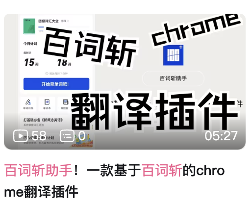

# 百词斩助手

百词斩助手是一款类似于谷歌翻译的 chrome 浏览器插件，它可以让你在电脑浏览器上使用百词斩查看英文单词释义、搜索中文查看对应的英文单词等  
  
另外登录账号后，在浏览器上进行的一些操作可以同步到手机 APP 中，如：收藏单词、取消收藏单词等  

  
(收藏后等待一些时间或重新进入 App，即可显示收藏的单词)

支持的功能：
- [x] 英文翻译中文
- [x] 图文模式
- [x] 收藏单词
- [ ] 取消收藏
- [ ] 中文翻译英文
- [ ] 管理单词本
- [ ] 查看收藏的单词
- [x] 支持暗黑主题

## 安装
1. Chrome 应用商店安装  
   - 地址栏输入 [https://chrome.google.com/webstore/category/extensions](https://chrome.google.com/webstore/category/extensions) 进入应用商店页面
   - 搜索 「百词斩助手」找到此插件
   - 点击「添加到Chrome」安装
2. 离线安装
   - 点击 [github](https://github.com/marmot-z/baicizhan-helper)/[gitee](https://gitee.com/mamotz/baicizhan-helper) 页面右侧的 [Release](https://github.com/marmot-z/baicizhan-helper/releases)/[发行版](https://gitee.com/mamotz/baicizhan-helper/releases) 下载最新版本的安装包   
   - 安装包文件修改后缀为 .rar，使用解压工具解压成文件夹
   - 地址栏输入 [chrome://extensions/](chrome://extensions/) 打开扩展程序页面，打开右上角开发者模式
   - 点击左上角「加载已解压的扩展程序」，选择安装包解压后的文件夹，既可安装此插件

## 使用
更多使用请参考[此文档](./usage.md) 或观看此视频 

## 声明
- 本项目仅方便大家学习英语，你可以自由使用此软件，但不能使用此软件从事任何形式的商业活动，且不能基于此软件进行二次开发
- 本项目完全开源，无任何安全风险。但其他渠道下载的插件安装包安全风险不予保证
- 安装、使用过程中出现一些问题可以尝试升级 chrome 浏览器版本，或者添加本人微信加入微信交流群进行反馈（请备注：百词斩助手）

## 代理服务器
如果你想搭建自己的代理服务器请看[此项目](https://github.com/marmot-z/baicizhan-helper-proxy)

## LICENSE
本项目基于 [Apache-2 licence](https://www.apache.org/licenses/LICENSE-2.0) 开发

最后，如果这个项目对你有所帮助，请给我点亮右上角的 :star: 吧