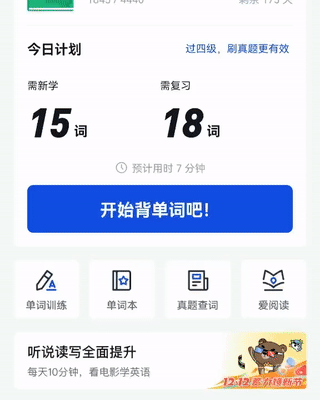

# 百词斩助手使用手册

在安装完插件后，你需要先在配置页面登录账号后才可以正常使用此插件的所有功能。另外我们也可以在配置页面设置一些选项，如：翻译弹窗样式、收藏英文的单词本等。

## 进入配置页面
安装插件成功后，点击浏览器右上角的①图标，会显示你所安装启用的所有插件，选择百词斩助手，点击位置②，再选中「选项」③，进入管理页面。  

## 账户登录
点击配置页右上角的登录下拉图标，点击登录按钮弹出登录表单  
  
输入手机号码，然后点击第二个输入框右侧的按钮获取验证码。查看手机上收到的验证码短信，在第二个输入框填入 6 位验证码，然后点击登录按钮进行登录

## 选择单词本
登录成功后，可以查看到对应的单词本列表，点击勾选图标选中后续收藏英文的单词本。

## 选择弹窗样式
点击左侧导航栏「弹窗样式」菜单，进入弹窗样式页面，在此你可以选择后续翻译弹窗的样式。分为两种：简洁模式（只显示单词、音标和释义）；图文模式（显示单词、音标、释义、示意图、例句和例句翻译）。

**简洁模式实际显示效果**  
  
**图文模式实际显示效果**  
  

## 选择弹窗弹出时机  
点击左侧导航栏「设置」菜单，进入设置页面，在此你可以设置翻译弹窗弹出的时机以及代理服务器。  
翻译弹窗弹出时机有三种：
- 显示点击既可翻译的图标。选中单词后显示一个图标，点击该图标进行翻译，不点击则不翻译；  

- 立即弹出翻译。选中单词后即进行翻译；
- 不显示图标和弹出式翻译。选中单词不进行翻译。  

## 设置代理服务器
由于网络、安全等原因，不能访问默认代理服务器或架设了自己的代理服务器，可调整代理服务器的地址指向新的代理服务器。代理服务器地址有两个参数：
- ip 可访问到的服务器 ip 地址或域名
- port 代理程序对外暴露的端口

修改前需自行验证该地址端口是否可以访问正常。**<u>不建议修改此参数</u>**。

## 翻译单词
打开你要访问的网页，选中一个英文单词，插件会自动获取单词对应的翻译内容。

## 收藏单词
在显示单词翻译内容弹窗后，点击弹窗右上角的五角星图标既可收藏单词到上述选择的单词本中（稍等一些时间或重进百词斩 APP，即可在对应的单词本中看到刚才收藏的单词了）。

